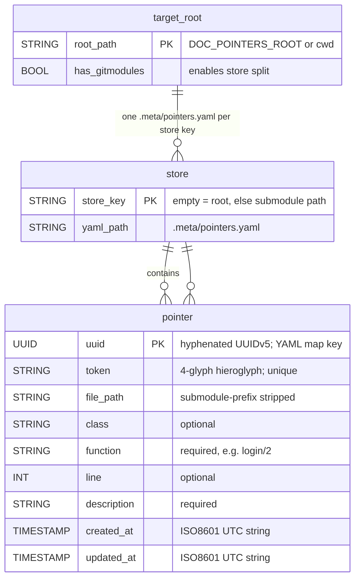

# Data & Config Schema — doc-pointers

**No persistence layer (no SQL/database).** `:doc_pointers` is an Elixir Mix app
with zero DB dependencies. All durable state lives in **flat YAML files written
into the *annotated target project*** (not this repo), plus a legacy JSON import
path. This doc is the single source of truth for those data formats and the
project's configuration surface.

- Canonical store: `{root|submodule}/.meta/pointers.yaml`
- Legacy import (read-once): `{root}/docs/doc-pointer-db.json`
- Runtime-only state: `DocPointers.Store` GenServer memory (never persisted here)

## ERD (logical)

One logical entity, `pointer`, grouped into per-store YAML documents. A target
root with a `.gitmodules` splits pointers across one YAML file per submodule
(longest-path match on `file_path`).



```plantuml
@startuml
skinparam linetype ortho

TABLE(store) {
  * store_key : STRING <<PK>> ' "" = root, else submodule path
  --
  yaml_path : STRING " .meta/pointers.yaml"
}

TABLE(pointer) {
  * uuid : UUID <<PK>> " hyphenated UUIDv5 = YAML map key"
  --
  * token : STRING " 4-glyph hieroglyph, unique"
  * function : STRING " e.g. login/2"
  * description : STRING
  file_path : STRING " optional; submodule prefix stripped"
  class : STRING " optional"
  line : INT " optional"
  created_at : TIMESTAMP " ISO8601 UTC string"
  updated_at : TIMESTAMP " ISO8601 UTC string"
}

store ||--o{ pointer : "pointers.yaml map"
@enduml
```

## Canonical store — `.meta/pointers.yaml`

Top level is a single-key map; entries are keyed by full hyphenated UUIDv5 and
serialized sorted by UUID. Nil fields are omitted (`Pointer.to_map/1` drops them).
No migration/changelog system — the writer (`Ymlr.document!/1`) rewrites the
whole file on every put/update.

```yaml
pointers:
  5c692577-ad0c-51f1-992c-759b5e5fffb5:
    token: 𓳔𔐮𔘟𔄵          # 4 codepoints, Egyptian/Meroitic/Anatolian blocks
    function: TestPointer      # required; "mod/fun/arity"-style name
    file_path: lib/foo.ex      # optional; relative to owning store
    class: MyApp.Auth          # optional
    line: 42                   # optional integer
    description: Golden vector # required
    created_at: "2026-09-01T12:00:00.000000Z"   # ISO8601 UTC, app-generated
    updated_at: "2026-09-01T12:00:00.000000Z"   # ISO8601 UTC, bumped on update
```

| Field | Type | Nullable | Written when | Notes |
|-------|------|----------|--------------|-------|
| *(map key)* | UUIDv5 (hyphenated string) | No | always | Stable identity; derived from name hash |
| `token` | String (4 glyphs) | No | always | Unique across loaded stores; collision → attempt suffix (max 10 000) |
| `function` | String | No | always | Part of UUIDv5 name derivation |
| `file_path` | String | Yes | if set | Relative to owning store; submodule prefix stripped before write |
| `class` | String | Yes | if set | Free-form grouping/filter key |
| `line` | Integer | Yes | if set | Advisory only (lines rot) |
| `description` | String | No | always | |
| `created_at` | ISO8601 UTC string | No (new records) | always | Set once by `Pointer.new/1` |
| `updated_at` | ISO8601 UTC string | No (new records) | always | Refreshed on `Store.update/2` |

**Store split rule:** if `{root}/.gitmodules` exists, each `path =` entry is a
store key. A pointer whose `file_path` falls under a submodule (prefix match +
`/`) is stored in that submodule's `.meta/pointers.yaml` with the prefix
stripped; longest path wins. `update/2` on `file_path` does **not** re-home the
record — it stays in its original store (`store_membership` is fixed at write).

**Legacy import:** when every YAML store is empty/absent and
`{root}/docs/doc-pointer-db.json` exists, it is imported once into the root
store and immediately re-saved as YAML.

## Legacy format — `docs/doc-pointer-db.json` (read-only)

Older Rust CLI format. Map of **token → record** (token, not UUID, is the key;
UUID is re-derived via `UUID5.build_name(data["name"] || token)`).

```json
{
  "𓳔𔐮𔘟𔄵": {
    "name": "TestPointer",
    "path": "lib/foo.ex",
    "description": "Golden vector",
    "line": 42
  }
}
```

| Field | Type | Nullable | Mapped to |
|-------|------|----------|-----------|
| *(map key)* | token string | No | `token` |
| `name` | String | Yes | `function` (fallback: token) |
| `path` | String | Yes | `file_path` |
| `description` | String | Yes | `description` (fallback `""`) |
| `line` | Integer | Yes | `line` |

## Runtime-only state (not persisted)

`DocPointers.Store` GenServer state — rebuilt from YAML on every boot /
`set_root/1`:

| Key | Shape | Purpose |
|-----|-------|---------|
| `root` | path string | Current target root |
| `submodules` | `[path]` sorted longest-first | Store-split detection |
| `pointers` | `%{uuid => %Pointer{}}` | Primary index |
| `token_index` | `%{token => uuid}` | Token lookup + uniqueness |
| `store_membership` | `%{uuid => store_key}` | Which YAML file a pointer writes back to |

## Configuration surface

| Knob | Default | Precedence / notes |
|------|---------|--------------------|
| `--root PATH` (CLI, both mix tasks) | — | Overrides env at task boot via `Store.set_root/1` |
| `DOC_POINTERS_ROOT` (env) | — | Read at OTP app start |
| `config :doc_pointers, root: …` (app env) | — | Used if env var unset |
| `File.cwd!/0` | — | Final fallback root |
| `--write` / `-w` (CLI) or `DOC_POINTERS_MCP_WRITES` ∈ {1,true,TRUE,yes,YES} | off | Enables `generate`/`update` tools + listing them; stored as `config :doc_pointers, :mcp_writes` |
| `confirm: true` (tool arg) | — | Per-call write approval when server started without `--write` |
| `--port N` (CLI) or `DOC_POINTERS_PORT` (env) | `4242` | HTTP transport only; binds `127.0.0.1` |

No secret material is read, stored, or required. Target-project `.meta/`
directories are the consumer's responsibility (typically gitignored or committed
by the annotated repo's policy — this repo does not own them).

## Maintenance checklist

- [ ] Field table matches `Pointer.to_map/1` / `from_map/2` in `lib/doc_pointers/pointer.ex`
- [ ] Store-split + legacy-import rules match `lib/doc_pointers/store.ex`
- [ ] Config knobs match `lib/doc_pointers/application.ex` + `mcp/runtime.ex`
- [ ] `PROJ-SCHEMA.summary.md` in sync
