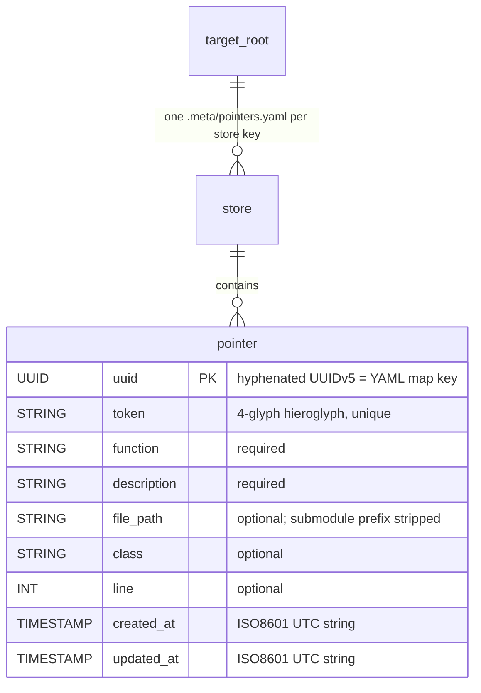

# Data & Config Schema Summary — doc-pointers

**No persistence layer (no SQL/DB).** Durable state = flat YAML files written
into the annotated target project; details in [PROJ-SCHEMA.md](PROJ-SCHEMA.md).

| Artifact | Path | Format | Role |
|----------|------|--------|------|
| Canonical store | `{root\|submodule}/.meta/pointers.yaml` | YAML, single `pointers:` map keyed by UUID | Read/write on every put/update |
| Legacy import | `{root}/docs/doc-pointer-db.json` | JSON map keyed by token | Read once when YAML empty; then re-saved as YAML |
| Runtime index | `DocPointers.Store` memory | maps (uuid, token→uuid, store membership) | Never persisted; rebuilt on boot |

| Config knob | Default | Notes |
|-------------|---------|-------|
| `--root` / `DOC_POINTERS_ROOT` / `config :doc_pointers, :root` / cwd | cwd | Target root, in that order |
| `--write` / `DOC_POINTERS_MCP_WRITES` | off | Enables generate/update MCP tools |
| `confirm: true` (tool arg) | — | Per-call write approval |
| `--port` / `DOC_POINTERS_PORT` | 4242 | HTTP transport, 127.0.0.1 only |

Store split: root `.gitmodules` ⇒ one YAML store per submodule (longest-path
match; prefix stripped). No secrets stored. Full field tables:
[PROJ-SCHEMA.md](PROJ-SCHEMA.md).
