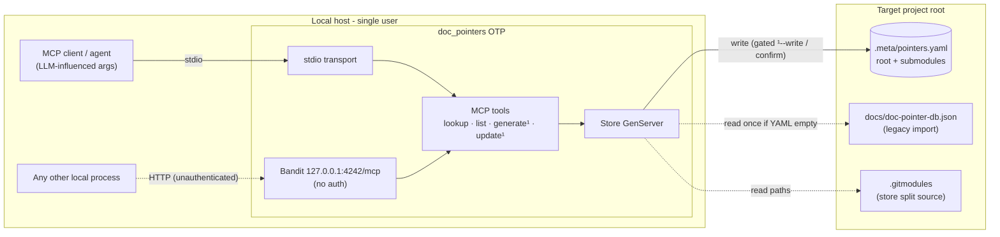

# Threat Model — doc-pointers

Security counterpart to [`PROJ-ARCH.md`](PROJ-ARCH.md). doc-pointers is a
**local, single-user tool**: an Elixir library + MCP server (stdio preferred,
optional loopback HTTP) that mints citation tokens and writes flat YAML into a
user-chosen target project. There is no network service, no multi-tenant data,
and no secret material. The assets that matter are (1) **integrity of the target
project's `.meta/pointers.yaml` files**, (2) **containment of filesystem writes
to the configured root**, and (3) **token uniqueness** (citations must not
silently retarget).

Trust boundaries: **MCP-client ↔ server** (tool args are LLM-influenced —
prompt injection is in scope), **local host ↔ loopback HTTP :4242** (any local
process, not just the intended client), and **server ↔ target filesystem**
(`--root` / `DOC_POINTERS_ROOT` / cwd, plus `.gitmodules`-derived store paths).
Grounding: components in [`PROJ-ARCH.md`](PROJ-ARCH.md); code map in
[`PROJ-LAYOUT.md`](PROJ-LAYOUT.md).

## Attack surface

Write tools (`generate`, `update`) are hidden unless the server is started with
`--write` / `DOC_POINTERS_MCP_WRITES`, and otherwise require per-call
`confirm: true` (`mcp/writes.ex`).

## Vulnerability register

| ID | Severity | STRIDE | Component | Status |
|----|----------|--------|-----------|--------|
| T-001 | Medium | Spoofing / EoP | HTTP transport: no auth on `127.0.0.1:4242/mcp`; any local process can act as the MCP client and (if `--write`) mutate stores | Partial — loopback-only bind is the sole control; stdio preferred |
| T-002 | Low | Tampering / EoP | MCP tool args are LLM-influenced; injected prompts could mint/update pointers or set arbitrary `file_path` | Mitigated — least-privilege default (write tools off), confirm gate; blast radius = citation metadata only |
| T-003 | Low | Tampering | Store split trusts `.gitmodules` paths verbatim (`Path.join(root, store_key)`); a `path = ../…` entry would direct YAML writes outside the root | Open — accepted: `.gitmodules` is repo-owner-controlled, same trust level as the code itself |
| T-004 | Low | Tampering | Legacy import parses untrusted `docs/doc-pointer-db.json` (token-keyed, UUID re-derived) when all YAML stores are empty | Mitigated — read-once, only on empty stores, immediately re-serialized as YAML |
| T-005 | Low | DoS | Single named GenServer serializes all calls; collision retry loop bounded at 10 000 attempts; `list` capped at 500/page | Mitigated — bounded loops and pagination |
| T-006 | Info | Repudiation | No audit log of who/when wrote a pointer (only `created_at`/`updated_at`) | Open — accepted for a single-user local tool; git history of the target repo provides the audit trail |
| T-007 | Info | Info disclosure | Pointer content (`function`, `description`, `file_path`) can echo source-internal names to any MCP client / local reader | Accepted — data is low-sensitivity; no secrets are read, stored, or required |

No SQL, no crypto keys beyond the public fixed UUIDv5 namespace, no
third-party egress, no container/ingress perimeter in this repo (deployment is
consumer-side).

## Mitigation coverage

2 mitigated · 1 partial · 2 open (both accepted) · 2 informational.

| Control | Covers | Where |
|---------|--------|-------|
| Write tools hidden unless `--write` / `DOC_POINTERS_MCP_WRITES`; per-call `confirm: true` gate | T-002 (and narrows T-001) | `lib/doc_pointers/mcp/writes.ex` |
| HTTP binds `127.0.0.1` only; stdio is the documented preferred transport | T-001 | `lib/doc_pointers/mcp/runtime.ex` |
| Collision retry cap (10 000) + list pagination cap (500) | T-005 | `lib/doc_pointers.ex`, `mcp/tools/list.ex` |
| Legacy import gated on empty stores, one-shot, re-encoded to YAML | T-004 | `lib/doc_pointers/store.ex` |

## Residual risk

Unauthenticated loopback HTTP (T-001) is accepted while the endpoint stays
loopback-only and write-off by default; retire `mcp.server` usage in favor of
`mcp.stdio` if this becomes untenable. `.gitmodules` path trust (T-003) and
absence of an audit log (T-006) are accepted as consequences of the local,
single-user, repo-owner-trusted threat context.

Tree is small — no `docs/threats/*` extracts.

## Maintenance checklist

- [ ] Register statuses match current code (`writes.ex`, `runtime.ex`, `store.ex`)
- [ ] T-001 re-evaluated if the HTTP bind ever leaves loopback
- [ ] `THREAT-MODEL.summary.md` in sync
